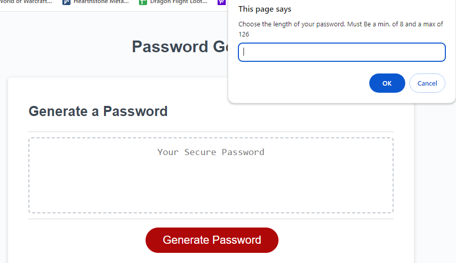
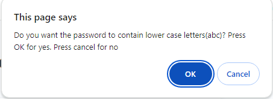
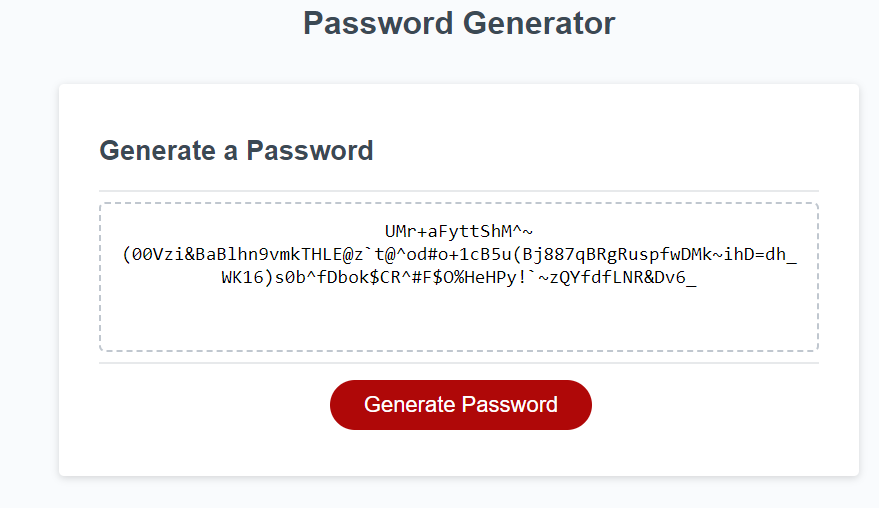

# <Password-Geneator>

## Description
    - Client has a need to for reliable password generation for security.
    - This project was built to allow the client and their users to select password length and included character types.
    - This project was able to solve the needs for the client by creating a password between 8-128 charcters long, and whether it would contain uppercase, lowercase, numbers, and special characters, in any combination of those 4, then printing that password to the page to be copied down.
    - I learned how to create functions that, prompt users with questions to answer, checking those answers against the client given criteria, and then storing all of the choices in an object to be used in a seperate function. In the seperate function I learned how to combine arrays if they were chosen to include the characters within the array for the final list of elemetns to be randomly chosen for the password. I learned how to iterate through for loops to select random indexes of an array to then push them into a new array for the final password. 

## Installation
    Web Page is in the link below
[Password-Generator](https://neglon.github.io/password-Generator)

## Usage
    Upon visiting the page, click the red generate password button to begin. You will then one by one be prompted with choices begiinging with desired password length, then if you want to include uppercase, followed by lowercase, followed by numbers and then finally with special characters. Clicking cancel on any of the choice prompts will take that as not to include the specified character type. Then once all choices are made an alert window will pop up with the password, and after clicking ok the password will then be printed to the webpage.
   

   

   

## Credits
    N/A

## Liscence
    N/A

## Code Source
    Original code was accessed via the course gitlab, and class material
[Uconn FSF Gitlab](https://git.bootcampcontent.com/University-of-Connecticut/CONN-VIRT-FSF-PT-11-2023-U-LOLC)
    

    